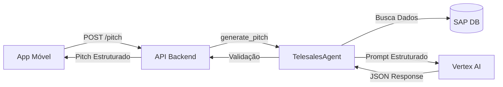
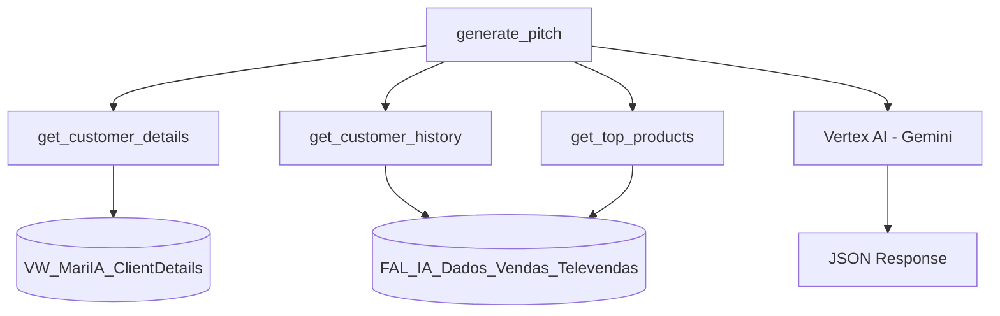

# Insights Parametrizados - Geração de Pitch de Vendas (Mari IA)

> [!NOTE]
> Análise detalhada dos prompts e parâmetros utilizados na geração do Pitch de Vendas do projeto MariIA. Este documento serve como base para otimização e entendimento da arquitetura de prompts.

---

## 1. Visão Geral da Geração de Pitch

### Localização do Código
- **Arquivo Principal**: [`telesales_agent.py`](file:///c:/Projetos/MariIA/src/agents/telesales_agent.py#L902-L981)
- **Endpoint API**: [`app.py`](file:///c:/Projetos/MariIA/src/api/app.py#L255-L291)
- **Modelo de IA**: Vertex AI (Gemini)

### Fluxo de Execução


---

## 2. Parâmetros de Entrada

### Parâmetros da Função `generate_pitch()`

| Parâmetro | Tipo | Obrigatório | Descrição |
|-----------|------|-------------|-----------|
| `card_code` | `str` | ✅ Sim | Código do cliente no SAP (ex: "C002416") |
| `target_sku` | `str` | ❌ Não | SKU específico para focar o pitch (atualmente não usado no prompt) |
| `vendor_filter` | `str` | ❌ Não | Filtro de vendedor (ID ou nome), resolvido internamente |

### Dados Contextuais Coletados

```python
# 1. Detalhes do Cliente
details = self.get_customer_details(card_code)
# Retorna: CardCode, CardName, Telefone, Email, Endereco, AtivoDesde

# 2. Histórico de Compras
hist = self.get_customer_history(card_code, limit=20)
# Retorna: Data_Emissao, Numero_Documento, SKU, Nome_Produto, 
#          Quantidade, Valor_Liquido, Nome_Cliente, Tipo_Documento, 
#          Status_Documento, Valor_Total_Linha, Valor_Unitario

# 3. Produtos Mais Vendidos da Empresa
top_selling = self.get_top_products(days=90)
# Retorna: SKU, Produto, Total (TOP 20)
```

---

## 3. Estrutura do Prompt (Engenharia de Prompt)

### Componentes do Prompt

#### 3.1 Identidade e Objetivo
```
Você é a MARI IA, a assistente de inteligência de vendas da Fantástico Alimentos.
Seu objetivo é gerar um PITCH DE VENDAS e um PEDIDO IDEAL para o vendedor 
abordar o cliente {customer_name} ({card_code}).
```

**Parametrização:**
- `{customer_name}`: Nome do cliente (variável)
- `{card_code}`: Código SAP do cliente (variável)

#### 3.2 Contexto de Dados

**Dados do Cliente:**
```
DADOS DO CLIENTE:
- Nome: {customer_name}
- Ativo Desde: {details.get('AtivoDesde', 'N/A')}
```

**Histórico de Compras:**
```
HISTÓRICO RECENTE DE COMPRAS:
{hist.to_markdown(index=False) if not hist.empty else "Nenhuma compra recente encontrada."}
```
- **Formato**: Tabela Markdown
- **Limite**: 20 últimas transações
- **Fallback**: Mensagem padrão se vazio

**Produtos Estratégicos:**
```
PRODUTOS MAIS VENDIDOS DA EMPRESA (PARA OPORTUNIDADES):
{top_selling}
```
- **Formato**: Tabela Markdown (SKU | Produto | Total)
- **Período**: 90 dias
- **Quantidade**: TOP 20 produtos

#### 3.3 Tarefas e Regras de Negócio (Core do Prompt)

| # | Tarefa | Instrução Detalhada |
|---|--------|---------------------|
| 1 | **Perfil de Compra** | Resumir o que o cliente compra (ex: Foco em Arroz, itens de cesta básica) |
| 2 | **Frequência** | Avaliar a recorrência e dias desde o último pedido faturado |
| 3 | **Pitch de Venda** | Criar uma abordagem curta (2-3 frases), matadora e persuasiva |
| 4 | **Pedido Ideal** | Sugerir 2 a 4 SKUs: ITENS RECORRENTES + 1 OPORTUNIDADE (do Top Selling não comprado) |
| 5 | **Transparência** | Retornar EXATAMENTE 3 motivos com títulos, ícones e conteúdos específicos |
| 6 | **Motivação** | Uma frase curta resumindo a estratégia (ex: "Reposição de estoque + Oportunidade de Mix") |

#### 3.4 Estrutura de Transparência (Regras Estritas)

> [!IMPORTANT]
> A estrutura de `reasons` é rigidamente definida com 3 elementos obrigatórios:

```json
"reasons": [
  {
    "title": "Timing Ideal",
    "icon": "history",
    "text": "Análise de dias desde a última compra e risco de ruptura."
  },
  {
    "title": "Giro Garantido",
    "icon": "star",
    "text": "SKU recorrente do cliente que não pode faltar."
  },
  {
    "title": "Oportunidade",
    "icon": "trending_up",
    "text": "Por que ele deve comprar o item novo sugerido (ex: é o mais vendido da cia)."
  }
]
```

**Parâmetros dos Reasons:**
| Campo | Tipo | Valores Aceitos | Obrigatório |
|-------|------|-----------------|-------------|
| `title` | `string` | "Timing Ideal", "Giro Garantido", "Oportunidade" | ✅ |
| `icon` | `string` | "history", "star", "trending_up" | ✅ |
| `text` | `string` | Texto explicativo livre | ✅ |

---

## 4. Schema de Resposta (JSON Estruturado)

### Configuração do Modelo
```python
generation_config={
    "response_mime_type": "application/json"
}
```

### Schema de Saída Esperado

```json
{
  "pitch_text": "string",              // 2-3 frases persuasivas
  "profile_summary": "string",          // Resumo do perfil de compra
  "frequency_assessment": "string",     // Análise de frequência
  "suggested_order": [                  // Array de 2-4 itens
    {
      "product_name": "string",
      "sku": "string",
      "quantity": "number",             // Quantidade sugerida (inteiro)
      "unit_price": "number"            // Preço unitário (decimal)
    }
  ],
  "motivation": "string",               // Frase de impacto curta
  "reasons": [                          // Exatamente 3 elementos
    {
      "title": "string",
      "text": "string",
      "icon": "string"
    }
  ]
}
```

### Validação e Fallback

**Validação de Campos:**
```python
for field in ["suggested_order", "reasons"]:
    if field not in data or not isinstance(data[field], list):
        data[field] = []
```

**Resposta de Fallback (em caso de erro):**
```json
{
  "pitch_text": "Olá! Notei que faz um tempo que não repomos o estoque de Arroz e Feijão Fantástico. Que tal aproveitar o pedido hoje?",
  "profile_summary": "Cliente recorrente de produtos básicos.",
  "frequency_assessment": "Frequência regular observada.",
  "suggested_order": [],
  "reasons": []
}
```

---

## 5. Parâmetros de Configuração Importantes

### Limites de Dados
| Parâmetro | Valor Atual | Ajustável | Impacto |
|-----------|-------------|-----------|---------|
| **Histórico de Compras** | 20 registros | ✅ Sim (`limit=20`) | Contexto do cliente |
| **Top Produtos** | 20 produtos, 90 dias | ✅ Sim (`days=90`) | Sugestões de oportunidade |
| **Comprimento do Pitch** | 2-3 frases | ✅ Sim (no prompt) | Concisão |
| **SKUs Sugeridos** | 2-4 itens | ✅ Sim (no prompt) | Tamanho do pedido |
| **Reasons** | Exatamente 3 | ⚠️ Hard-coded | Estrutura do UI |

### Formatação de SKU
```python
@staticmethod
def _format_sku(val):
    """Padroniza SKU para ter pelo menos 4 dígitos inteiros 
    (ex: 5 -> 0005, 201.1 -> 0201.1)."""
    if val is None: return ""
    s = str(val).strip()
    if '.' in s:
        parts = s.split('.')
        return parts[0].zfill(4) + '.' + parts[1]
    else:
        return s.zfill(4)
```
**Impacto**: Garante consistência na identificação de produtos.

---

## 6. Insights de Otimização e Parametrização

### 6.1 Pontos de Ajuste Recomendados

#### A) Quantidade de Contexto
```python
# Original
hist = self.get_customer_history(card_code, limit=20)

# Parametrizável
PITCH_HISTORY_LIMIT = config.get('pitch.history_limit', 20)
hist = self.get_customer_history(card_code, limit=PITCH_HISTORY_LIMIT)
```

#### B) Período de Análise de Produtos
```python
# Original
top_selling = self.get_top_products(days=90)

# Parametrizável
PITCH_TOP_PRODUCTS_DAYS = config.get('pitch.top_products_days', 90)
top_selling = self.get_top_products(days=PITCH_TOP_PRODUCTS_DAYS)
```

#### C) Tamanho do Pedido Sugerido
```python
# No Prompt
"Sugira 2 a 4 SKUs..."

# Parametrizável
MIN_SKUS = config.get('pitch.min_skus', 2)
MAX_SKUS = config.get('pitch.max_skus', 4)
f"Sugira {MIN_SKUS} a {MAX_SKUS} SKUs..."
```

#### D) Comprimento do Pitch
```python
# No Prompt
"Crie uma abordagem curta (2-3 frases)..."

# Parametrizável
PITCH_SENTENCES = config.get('pitch.sentences', '2-3')
f"Crie uma abordagem curta ({PITCH_SENTENCES} frases)..."
```

### 6.2 Categorias de Produtos (Hard-coded)

> [!WARNING]
> As categorias estão fixas no código. Considerar parametrização via banco de dados.

```python
# Em get_sales_trend()
CASE 
    WHEN Categoria_Produto LIKE '%ARROZ%' THEN 'Arroz'
    WHEN Categoria_Produto LIKE '%FEIJAO%' THEN 'Feijão'
    WHEN Categoria_Produto LIKE '%MASSA%' THEN 'Massas'
    ELSE 'Outros'
END
```

**Sugestão**: Mover para tabela de configuração no SAP.

### 6.3 Parâmetros de Pricing

> [!CAUTION]
> Os preços unitários (`unit_price`) são gerados pela IA baseados em contexto histórico. Não há validação de tabela de preços vigente.

**Risco**: Pitch pode sugerir preços desatualizados.

**Solução**: Integrar API de pricing do SAP no contexto do prompt.

---

## 7. Logging e Métricas

### Sistema de Logging Atual

```python
from src.utils.logger import log_pitch_usage, log_pitch_feedback
```

#### Função: `log_pitch_usage()`
**Parâmetros:**
```python
log_pitch_usage(
    card_code: str,
    target_sku: str,
    pitch_generated: str,
    pitch_id: str,
    user_id: str = None,
    metadata: dict = None
)
```

**Arquivo de Log**: `logs/pitch_usage.jsonl`

**Estrutura do Evento:**
```json
{
  "event": "pitch_generated",
  "pitch_id": "uuid",
  "timestamp": "ISO8601",
  "card_code": "C002416",
  "target_sku": "0005",
  "user_id": "vendedor@fantástico.com",
  "pitch_generated": "...",
  "metadata": {}
}
```

#### Função: `log_pitch_feedback()`
**Parâmetros:**
```python
log_pitch_feedback(
    pitch_id: str,
    feedback_type: str,
    user_id: str = None
)
```

**Estrutura do Evento:**
```json
{
  "event": "pitch_feedback",
  "pitch_id": "uuid",
  "timestamp": "ISO8601",
  "feedback_type": "accepted|rejected|modified",
  "user_id": "vendedor@fantástico.com"
}
```

---

## 8. Parâmetros para Testes A/B

### Variáveis Testáveis

| Variável | Tipo | Range Sugerido | Métrica de Sucesso |
|----------|------|----------------|-------------------|
| **Histórico de Compras** | `int` | 10-50 | Taxa de aceitação do pitch |
| **Período Top Products** | `int` | 30-180 dias | Conversão de oportunidades |
| **Quantidade de SKUs** | `string` | "2-3", "3-5", "4-6" | Tamanho médio do pedido |
| **Tom do Pitch** | `string` | "formal", "casual", "urgente" | Engajamento do vendedor |
| **Ênfase em Oportunidade** | `boolean` | true/false | Mix de produtos |

### Exemplo de Configuração A/B

```json
{
  "variants": {
    "control": {
      "history_limit": 20,
      "top_products_days": 90,
      "sku_range": "2-4",
      "tone": "persuasiva"
    },
    "variant_a": {
      "history_limit": 30,
      "top_products_days": 60,
      "sku_range": "3-5",
      "tone": "urgente"
    },
    "variant_b": {
      "history_limit": 15,
      "top_products_days": 120,
      "sku_range": "2-3",
      "tone": "consultiva"
    }
  }
}
```

---

## 9. Dependências e Integrações

### APIs Utilizadas


### Tabelas/Views do SAP

| Nome | Tipo | Uso no Pitch |
|------|------|--------------|
| `VW_MariIA_ClientDetails` | View | Dados cadastrais do cliente |
| `FAL_IA_Dados_Vendas_Televendas` | Tabela/View | Histórico de compras e top produtos |
| `OSLP` | Tabela | Resolução de SlpCode -> Nome do Vendedor |

### Modelo de IA
- **Provider**: Google Vertex AI
- **Modelo**: Gemini (família)
- **Formato de Resposta**: JSON estruturado
- **Timeout**: Não especificado (usar default da lib)
- **Retry**: Não implementado (fallback simples em caso de erro)

---

## 10. Checklist de Validação do Pitch

### Validações Implementadas

- [x] `suggested_order` é uma lista (array)
- [x] `reasons` é uma lista (array)
- [x] Fallback em caso de erro de geração
- [x] SKUs formatados com padding (4 dígitos)

### Validações Recomendadas (Não Implementadas)

- [ ] Verificar se `quantity` em `suggested_order` é numérico e > 0
- [ ] Verificar se `unit_price` existe em tabela de preços vigente
- [ ] Validar se SKUs sugeridos estão ativos no catálogo
- [ ] Garantir que `reasons` tenha exatamente 3 elementos com títulos corretos
- [ ] Verificar se produtos sugeridos estão em estoque
- [ ] Limitar o valor total do pedido a um threshold do perfil do cliente

---

## 11. Roadmap de Melhorias

### Curto Prazo (1-2 sprints)
1. **Parametrização via Configuração**
   - Criar arquivo `pitch_config.json` com todos os parâmetros ajustáveis
   - Implementar validação de schema
   
2. **Validação Robusta de Resposta**
   - Adicionar validação de `reasons` (exatamente 3 elementos)
   - Verificar tipos de dados (`quantity` como `int`, `unit_price` como `float`)

3. **Integração com Tabela de Preços**
   - Buscar preços vigentes do SAP antes de enviar ao modelo
   - Incluir no contexto do prompt

### Médio Prazo (3-6 sprints)
4. **Dashboard de Métricas**
   - Taxa de aceitação de pitches por vendedor
   - Análise de conversão de oportunidades sugeridas
   - Comparação de tamanho médio de pedido (sugerido vs realizado)

5. **Fine-tuning do Modelo**
   - Coletar dados de pitches aceitos vs rejeitados
   - Treinar modelo custom com base em histórico de sucesso

6. **Personalização por Vendedor**
   - Permitir que cada vendedor tenha seu "estilo" de pitch
   - Parâmetros de tom, quantidade de SKUs, etc.

### Longo Prazo (6+ sprints)
7. **Previsão de Demanda Integrada**
   - Usar modelo de ML para prever quantidade ideal (não apenas média histórica)
   - Considerar sazonalidade, tendências, estoque do cliente

8. **Pitch Multicanal**
   - Gerar versões do pitch para WhatsApp, Email, Ligação
   - Adaptação de tom e formato por canal

---

## 12. Exemplo de Payload Completo

### Request
```json
{
  "card_code": "C002416",
  "target_sku": "",
  "vendor_filter": "João Silva"
}
```

### Response (Exemplo de Sucesso)
```json
{
  "pitch_text": "Olá! Notei que sua última compra de Arroz Fantástico foi há 18 dias, e historicamente você reabastece a cada 15 dias. Que tal garantir o estoque hoje e aproveitar para testar nosso Feijão Preto, que está entre os mais vendidos da região?",
  "profile_summary": "Cliente fiel com foco em cesta básica (Arroz, Feijão, Massas). Compra média de 45 fardos por pedido.",
  "frequency_assessment": "Última compra há 18 dias. Média de reposição: 15 dias. Risco de ruptura: Médio.",
  "suggested_order": [
    {
      "product_name": "Arroz Branco Fantástico 5kg",
      "sku": "0005",
      "quantity": 30,
      "unit_price": 24.90
    },
    {
      "product_name": "Feijão Carioca Fantástico 1kg",
      "sku": "0012",
      "quantity": 20,
      "unit_price": 7.50
    },
    {
      "product_name": "Feijão Preto Fantástico 1kg",
      "sku": "0013",
      "quantity": 10,
      "unit_price": 7.80
    }
  ],
  "motivation": "Reposição estratégica + Mix premium",
  "reasons": [
    {
      "title": "Timing Ideal",
      "text": "Última compra há 18 dias, acima da média de 15 dias. Risco moderado de ruptura de estoque.",
      "icon": "history"
    },
    {
      "title": "Giro Garantido",
      "text": "Arroz Fantástico 5kg representa 60% do seu mix histórico. Item essencial para manter fluxo de vendas.",
      "icon": "star"
    },
    {
      "title": "Oportunidade",
      "text": "Feijão Preto é o 3º mais vendido da região e você ainda não experimentou. Margem superior ao Carioca.",
      "icon": "trending_up"
    }
  ]
}
```

---

## 13. Referências Técnicas

### Arquivos Principais
- [telesales_agent.py](file:///c:/Projetos/MariIA/src/agents/telesales_agent.py) - Lógica de geração
- [app.py](file:///c:/Projetos/MariIA/src/api/app.py) - Endpoint `/pitch`
- [logger.py](file:///c:/Projetos/MariIA/src/utils/logger.py) - Sistema de logging

### Documentação Externa
- [Vertex AI Generative AI SDK](https://cloud.google.com/vertex-ai/docs/generative-ai/model-reference/gemini)
- [Structured Output with Gemini](https://cloud.google.com/vertex-ai/docs/generative-ai/multimodal/json-mode)

### Conversas Relacionadas
- [Fixing AI Pitch Generation](conversation://336af798-c2d5-4114-a4a6-067d65524fee) - Debugging de pitch e reasons
- [SAP Bot Integration](conversation://b550ccc2-5140-4064-b722-564c0932a32b) - Integração com SAP

---

**Última Atualização**: 2026-02-07  
**Versão do Documento**: 1.0  
**Autor**: Análise Automática via Mari IA Agent
