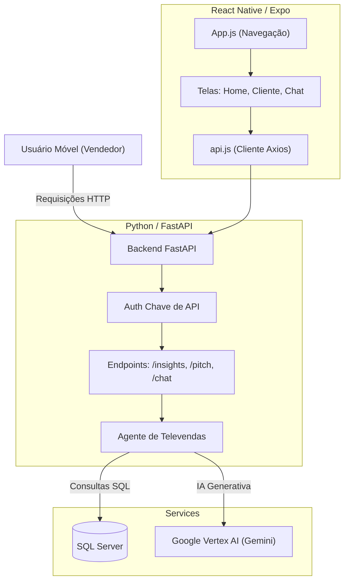

# MariIA - Visão Geral Técnica

## 1. Visão Geral do Projeto
O MariIA é um ecossistema inteligente projetado para otimizar operações de varejo e televendas. Ele integra um ERP (SQL Server) com Inteligência Artificial Generativa (Google Vertex AI) para fornecer aos agentes de vendas insights acionáveis, discursos de vendas personalizados e análise de dados automatizada por meio de um aplicativo móvel.

## 2. Arquitetura

## 3. Stack Tecnológico

### Backend
- **Linguagem**: Python 3.10+
- **Framework**: FastAPI
- **IA/ML**: Google Vertex AI SDK (`google-cloud-aiplatform`), Modelos Gemini (1.5 Pro / 3.0 Pro)
- **Banco de Dados**: SQL Server (ODBC Driver 17), SQLAlchemy, pyodbc, pandas
- **Servidor**: Uvicorn

### Mobile
- **Framework**: React Native (via Expo)
- **Linguagem**: JavaScript / JSX
- **Estilização**: Tailwind CSS (`twrnc`)
- **Navegação**: React Navigation (Stack)
- **Cliente HTTP**: Axios

## 4. Análise do Backend

### Componentes Principais
- **`src/api/app.py`**: O ponto de entrada.
    - Expõe endpoints como `/insights` (ranking), `/pitch` (gerar discurso de vendas) e `/chat/stream`.
    - Implementa autenticação por Chave de API (`x-api-key`).
    - Usa uma instância global de `TelesalesAgent` para reutilização de conexão.
    - Cuida da limpeza de dados (tratamento de NaN, conversão de Decimal) antes da serialização JSON.

- **`src/agents/telesales_agent.py`**: O cérebro do sistema.
    - **Inicialização**: Conecta-se à Vertex AI e ao SQL Server.
    - **Ferramentas**: Define "Declarações de Função" (Tools) que a IA pode chamar, como:
        - `get_customer_history_markdown`: Busca histórico de compras.
        - `get_sales_insights_markdown`: Analisa vendas de clientes ativos.
        - `get_inactive_customers_markdown`: Identifica risco de churn.
    - **Geração**: `generate_pitch` constrói um prompt estruturado combinando dados do cliente + produtos principais + regras de negócio para gerar um JSON com texto do pitch e sugestões de pedido.
    - **Chat**: Implementa um loop de chat em streaming (`chat_stream`) que lida com o loop manual de "Chamada de Função Automática" (detecta chamada de ferramenta -> executa SQL -> alimenta de volta para a IA).

- **`src/database/connector.py`**:
    - Gerencia a string de conexão do SQL Server usando `sqlalchemy` + `pyodbc`.
    - Implementa um padrão singleton para o engine do banco de dados.
    - Fornece `get_dataframe` para execução segura de SQL parametrizado retornando DataFrames do Pandas.

## 5. Análise Mobile

### Componentes Principais
- **`mobile/App.js`**:
    - Configura o navegador de pilha `Usage` (`Home`, `Customer`, `Chat`).
    - Carrega fontes (MaterialIcons).
    - Estilo de cabeçalho hardcoded (`#1A2F5A`).

- **`mobile/src/services/api.js`**:
    - Instância centralizada do Axios.
    - Configura a URL Base dinamicamente (URL de Prod `mariia-backend...run.app` vs IP Local).
    - Injeção de Chave de API via cabeçalhos.
    - Envolve endpoints com tratamento de erros.

- **`mobile/src/screens/`**:
    - `HomeScreen.jsx`: Dashboard com resumos de KPIs e navegação.
    - `CustomerScreen.jsx`: Visão detalhada de um cliente específico, provavelmente acionando a geração de "Pitch".
    - `ChatScreen.jsx`: Interface de chat para interagir com o `TelesalesAgent`.

## 6. Fluxos de Dados Principais

### O Fluxo de Geração de "Pitch"
1. **Ação do Usuário**: O usuário visualiza um cliente no app móvel e solicita um pitch.
2. **Mobile**: Chama `POST /pitch` com `card_code` e `target_sku`.
3. **Backend (`app.py`)**: Recebe a requisição, invoca `agent.generate_pitch`.
4. **Agente (`telesales_agent.py`)**:
    - Busca detalhes do cliente (SQL).
    - Busca histórico de compras (SQL).
    - Busca produtos mais vendidos (SQL).
    - **Prompting**: Monta todo esse contexto em um prompt massivo para o Gemini.
5. **IA**: Gera uma resposta JSON com "Texto do Pitch", "Pedido Sugerido" e "Motivos".
6. **Backend**: Registra o uso e retorna o JSON.
7. **Mobile**: Renderiza a UI do "Cartão de Pitch" com insights de valor agregado.

## 7. Configuração e Segurança
- **Ambiente**: Arquivo `.env` (não commitado) contém lógica sensível (Credenciais de DB, ID do Projeto).
- **Segurança**:
    - Prevenção de Injeção de SQL via queries parametrizadas.
    - Segurança de Gateway de API via Chave de API.
    - HTTPS forçado no Cloud Run.
